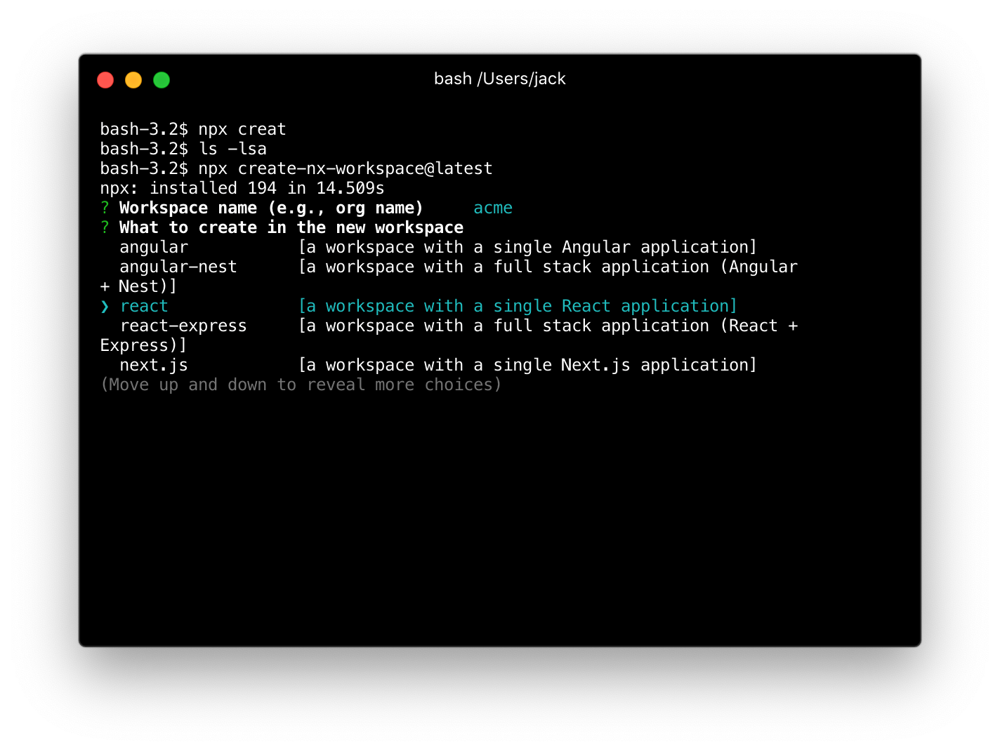
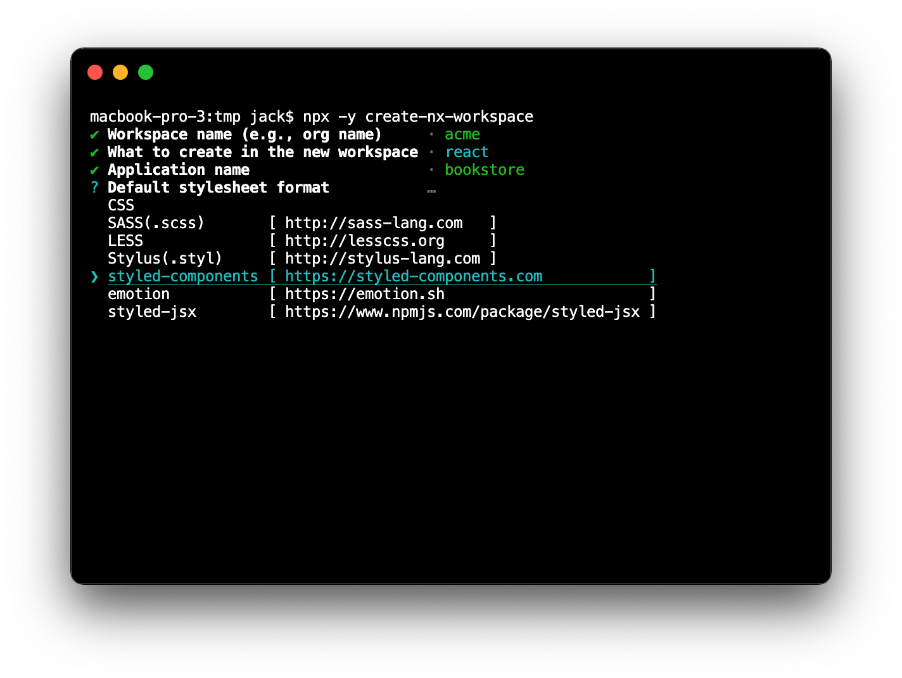
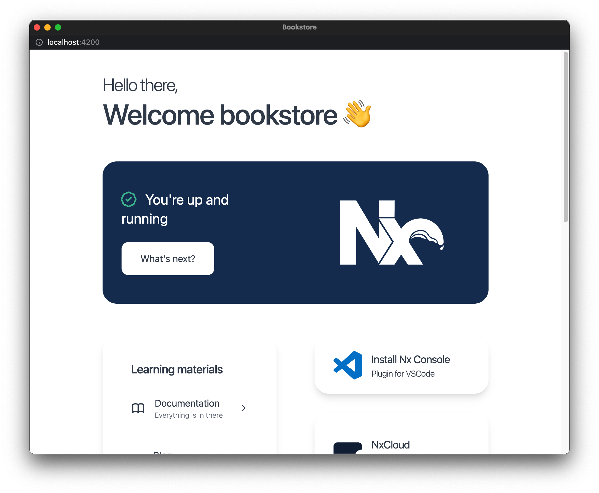
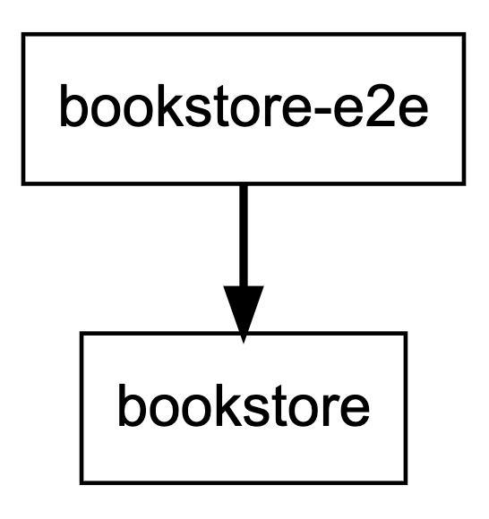

{#chapter-1}
# Chapter 1: Getting started

Let's start by going through the terminology that Nx uses.

**Workspace**
: A folder created using Nx that contain applications and libraries, as well as scaffolding to help with building, linting, and testing.

**Project**
: An application or library within the workspace.
  
**Application**
: A package that uses multiple libraries to form a runnable program. An application is usually either run in the browser or by Node.

**Library**
: A set of files that deal with related concerns. For example, a shared component UI library.

Now, let's create our workspace.

## Creating an Nx workspace

You can create the workspace as follows:

```bash
npx create-nx-workspace
```

I> Note: The `npx` binary comes bundled with NodeJS. It allows you to conveniently install then run a Node binary.

Nx will ask you for a **workspace name**. Let's use `myorg` as it is the name of our imaginary organization. The workspace name is used by Nx to scope our libraries, just like [npm scoped packages](https://docs.npmjs.com/misc/scope).

Next, you'll be prompted to select a **preset**--choose the `react` option.



Lastly, you'll be prompted for the application name and the styling format you want to use. Let's use `bookstore` as our application name and `styled-components` for styling.



Once Nx finishes creating the workspace, we will end up with something like this:

```
myorg
├── apps
│   ├── bookstore
│   │   ├── src
│   │   │   ├── app
│   │   │   ├── assets
│   │   │   ├── environments
│   │   │   ├── favicon.ico
│   │   │   ├── index.html
│   │   │   ├── main.tsx
│   │   │   └── polyfills.ts
│   │   ├── browserslist
│   │   ├── jest.config.js
│   │   ├── tsconfig.app.json
│   │   ├── tsconfig.json
│   │   └── tsconfig.spec.json
│   └── bookstore-e2e
├── libs
├── tools
│   ├── schematics
│   └── tsconfig.tools.json
├── README.md
├── nx.json
├── package.json
├── tools
├── tsconfig.json
└── workspace.json
```

The `apps` folder contain the code of all applications in our workspace. Nx has created two applications by default:

- The `bookstore` application itself; and 
- A set of end-to-end (e2e) tests written to test `bookstore` application.

The `libs` folder will eventually contain our libraries (more on that in [Chapter 2](#chapter-2)). It is empty for now.

The `tools` folder can be used for scripts that are specific to the workspace. The generated `tools/schematics` folder is for Nx's workspace schematics feature which we cover in [Appendix A](#appendix-a).

The `nx.json` file configures Nx (as we'll see in [Chapter 4](#chapter-4)).

The `workspace.json` file configures our projects (applications and libraries) within the workspace. Here, you can specify what and how commands like `lint`, `test`, and `e2e` are run.

To serve the application, use this command:

```bash
nx serve bookstore
```

The above command will build the `bookstore` application, then start a development server at port 4200.
 
When we navigate to <http://localhost:4200> we are presented with a friendly welcome page.



## Nx commands

Nx comes with a set of targets that can be executed on our projects. You run a target by running commands in the form: `nx [target] [project]`.

For example, for our `bookstore` app we can run the following targets.

```bash
# Run a linter for the application
npx nx lint bookstore

# Run unit tests for the application
npx nx test bookstore

# Run e2e tests  for the application
npx nx e2e bookstore-e2e
```

Give these commands a try!


Lastly, Nx allows us to examine the dependency graph of our workspace with the `nx dep-graph`
command.



There isn't much in the workspace to make this graph useful just yet, but we will see in later chapters how this feature can help us understand the architecture of our application, and how changes to code affect various projects within the workspace.

### Install Nx globally (optional)

It's easier to work with Nx when we have it installed globally. You can do this by running:

```bash
npm install -g @nrwl/cli
```

Check that the install has worked by issuing the command `nx --version`.

Now you will be able to run Nx commands without going through `yarn` (e.g. `nx serve bookstore`).

For the rest of this book, I will assume that you have Nx installed globally. If you haven't, simply run all issued commands through `yarn`.

## Preparing for development

Let's end this chapter by removing the generated content from the `bookstore` application and adding some configuration to the workspace.

Open up your favorite editor and modify these three files.

**apps/bookstore/src/app/app.tsx**

```typescript
import React from 'react';
import styled from 'styled-components';

const StyledApp = styled.div``;

export const App = () => {
  return (
    <StyledApp>
      <header>
        <h1>Bookstore</h1>
      </header>
    </StyledApp>
  );
};

export default App;
```

**apps/bookstore/src/app/app.spec.tsx**

```typescript
import React from 'react';
import { render, cleanup } from '@testing-library/react';

import App from './app';

describe('App', () => {
  afterEach(cleanup);

  it('should render successfully', () => {
    const { baseElement } = render(<App />);

    expect(baseElement).toBeTruthy();
  });

  it('should have a header as the title', () => {
    const { getByText } = render(<App />);

    expect(getByText('Bookstore')).toBeTruthy();
  });
});
```

**apps/bookstore-e2e/src/integration/app.spec.ts**

```typescript
import { getGreeting } from '../support/app.po';

describe('bookstore', () => {
  beforeEach(() => cy.visit('/'));

  it('should display welcome message', () => {
    getGreeting().contains('Bookstore');
  });
});
```

Make sure the tests still pass:

- `nx test bookstore`
- `nx e2e bookstore-e2e`

It's a good idea to commit our code before making any more changes.

```bash
git add .
git commit -m 'end of chapter one'
```

***

T> **Key points**
T>
T> An Nx workspace consists of two types of projects: *applications* and *libraries*.
T>
T> A newly created workspace comes with a set of targets we can run on the generated application: `lint`, `test`, and `e2e`.
T> 
T> Nx also has a tool for displaying the dependency graph of all the projects within the workspace.
