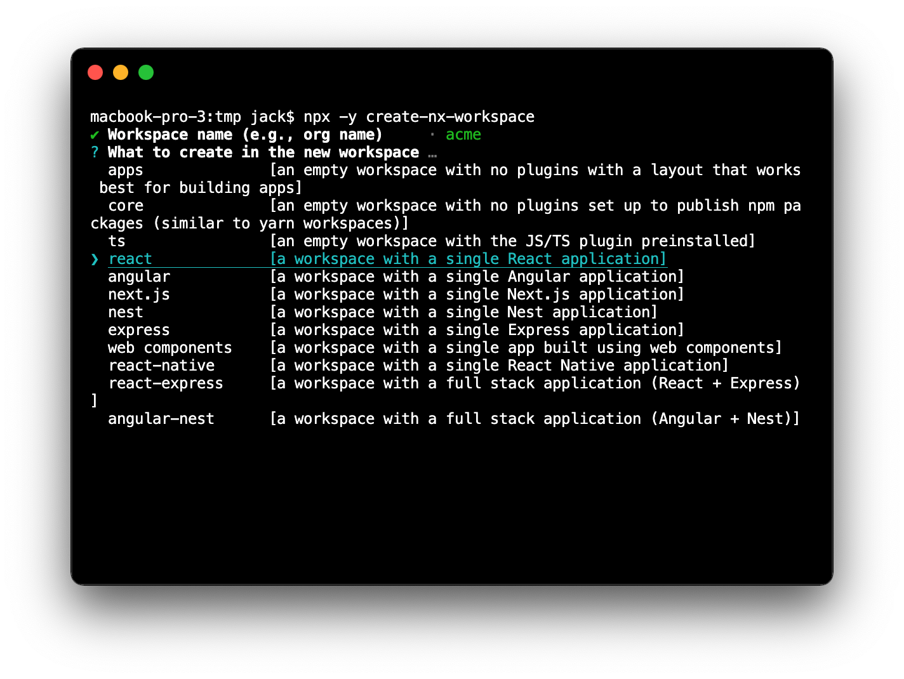
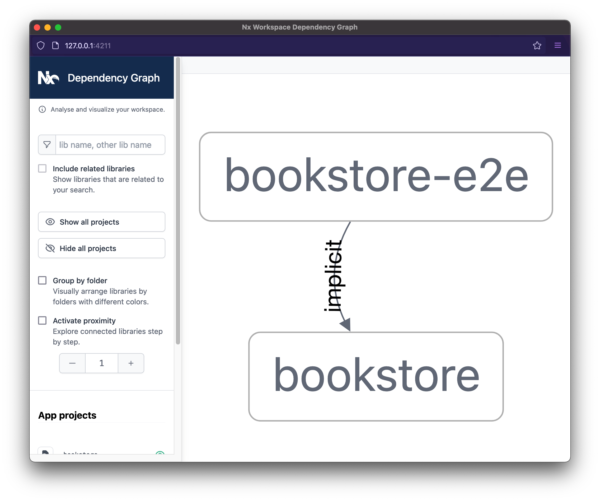

{#chapter-1}
# Chapter 1: Getting started

Let's start by going through the terminology that Nx uses.

**Workspace**
: A folder created using Nx that contains applications and libraries, as well as scaffolding to help with building, linting, and testing.

**Project**
: An application or library within the workspace.
  
**Application**
: A package that uses multiple libraries to form a runnable program. An application is usually either run in the browser or by Node.

**Library**
: A set of files that deal with related concerns. For example, a shared component library.

Now, let's create our workspace.

## Creating a Nx workspace

You can create the workspace as follows:

```bash
npx create-nx-workspace@latest
```

I> Note: The `npx` binary comes bundled with NodeJS. It allows you to conveniently install then run a Node binary without the need to install it globally.

Nx will ask you for a **workspace name**. Let's use `acme` as it is the name of our imaginary organization. The workspace name is used by Nx to scope our libraries, just like [npm scoped packages](https://docs.npmjs.com/misc/scope).

Next, you'll be prompted to select a **preset**--choose the `react` option.



After choosing the preset, you'll be prompted for the application name, and the styling format you want to use. Let's use `bookstore` as our application name and `styled-components` for styling.


In addition, Nx asks about setting up Nx Cloud[^nxcloud]. Nx Cloud adds remote distributed computation caching and other performance enhancing features to the Nx workspace. Even though it is the commercial addon for Nx, it comes with a generous free tier. So feel free to go ahead and enable it or skip it entirely.

[^nxcloud]: [https://nx.app](https://nx.app)


I> Note: If you prefer Yarn over npm, you can pass the `--packageManager=yarn` flag to the `create-nx-workspace`.

Once Nx finishes creating the workspace, we will end up with something like this:

```text
.
├── apps
│   ├── bookstore
│   │   ├── src
│   │   ├── jest.config.js
│   │   ├── project.json
│   │   ├── tsconfig.app.json
│   │   ├── tsconfig.json
│   │   └── tsconfig.spec.json
│   └── bookstore-e2e
│       ├── src
│       ├── cypress.json
│       ├── project.json
│       └── tsconfig.json
├── libs
├── babel.config.json
├── jest.config.js
├── jest.preset.js
├── README.md
├── nx.json
├── package-lock.json
├── package.json
├── tools
│   ├── generators
│   └── tsconfig.tools.json
├── tsconfig.base.json
└── workspace.json
```

The `apps` folder contains the code of all applications in our workspace. Nx has created two applications by default:

- The `bookstore` application itself; and 
- A set of end-to-end (E2E) tests written to test the `bookstore` application using Cypress[^cypresslink].

[^cypresslink]: [https://www.cypress.io/](https://www.cypress.io/)

The `libs` folder will eventually contain our libraries (more on that in [Chapter 2](#chapter-2)). It is empty for now.

The `tools` folder can be used for scripts that are specific to the workspace. The generated `tools/generators` folder 
is for Nx's [workspace generators](https://nx.dev/generators/workspace-generators) feature which you can learn more about
by reading the documentation at https://nx.dev/generators/workspace-generators.

The `nx.json` file configures Nx. We're going to have a closer look at that in [Chapter 4](#chapter-4).

To serve the application, use this command:

```bash
npm start
```

The above command uses the `start` script in the main `package.json` which builds the `bookstore` application and then starts a development server at port 4200.
 
When we navigate to <http://localhost:4200> we are presented with a friendly welcome page.


## Nx workspace configuration

Nx is built in a modular fasion consisting of a core infrastructure that provides the foundation such as for the dependency graph calculation, running generators and migrations, computation caching and more, and a set of plugins that provide technology specific features (such as `@nrwl/react` for React development). Those plugins are developed and maintained by the Nx core team as well as the community[^communityplugins]).

[^communityplugins]: [https://nx.dev/community](https://nx.dev/community)

This allows to gradually dive deeper into the Nx features or simply to just start in a more lightweight fasion. You could easily just use the Nx core[^nxcore] and rely on other tooling such as Yarn/Npm workspaces to do the linking. Yet, you would miss out on a lot of features.

[^nxcore]: [https://nx.dev/getting-started/nx-core](https://nx.dev/getting-started/nx-core)

In this book we're going full-in. This allows us to explore all the features Nx can bring to the table when it comes to React development and thus set us up to be most productive. This setup comes with some configuration files that provide Nx with the necessary meta-data to be able to best reason about the structure of the underlying workspace. Let's briefly explore them in more detail.

The previously generated workspace comes with the follow Nx specific configuration files:

- `nx.json`
- `workspace.json`
- `project.json`

The `nx.json` is at the root of the workspace and configures the Nx CLI. It allows to specify things such as defaults for projects and code scaffolding, the workspace layout, task runner options and computation cache configuration and more. Here's an excerpt of what got generated for our example workspace.

```json
{
  "npmScope": "acme",
  "affected": {
    "defaultBase": "main"
  },
  "cli": {
    "defaultCollection": "@nrwl/react"
  },
  "implicitDependencies": {
    "package.json": {
      "dependencies": "*",
      "devDependencies": "*"
    },
    ".eslintrc.json": "*"
  },
  "tasksRunnerOptions": {
    "default": {
      "runner": "@nrwl/workspace/tasks-runners/default",
      "options": {
        "cacheableOperations": ["build", "lint", "test", "e2e"]
      }
    }
  },
  "targetDependencies": {
    "build": [
      {
        "target": "build",
        "projects": "dependencies"
      }
    ]
  },
  "generators": {
    "@nrwl/react": {
      "application": {
        "style": "styled-components",
        "linter": "eslint",
        "babel": true
      },
      ...
    }
  },
  ...
}
```

The `workspace.json` file in the root directory is optional. It's used to list the projects in your workspace explicitly, instead of having Nx scan the file tree for all project.json and package.json files.

The `project.json` file is located at the root of every project in your workspace. This is where the project specific metadata is defined as well as the "targets". A Nx target is literally a "task" that can be invoked on the project. Open the `apps/bookstore/project.json` of the `bookstore` application:

```json
{
  "root": "apps/bookstore",
  "sourceRoot": "apps/bookstore/src",
  "projectType": "application",
  "targets": {
    "build": { ... },
    "serve": { ... },
    "lint": { ... }
    "test": { ... }
  },
  ...
}
```

It contains targets for invoking a `build`, `serve` for serving the app during development as well as targets for linting (`lint`) and testing (`test`). These are the ones generated by default, but you are free to add your own as well.

Each of these targets comes with a set of things that can be configured. Let's have a look at the `build` target:

```json
{
  ...
  "targets": {
    "build": {
      "executor": "@nrwl/web:webpack",
      "outputs": ["{options.outputPath}"],
      "options": {
        "compiler": "babel",
        "outputPath": "dist/apps/bookstore",
        "index": "apps/bookstore/src/index.html",
        "baseHref": "/",
        "main": "apps/bookstore/src/main.tsx",
        "polyfills": "apps/bookstore/src/polyfills.ts",
        "tsConfig": "apps/bookstore/tsconfig.app.json",
        "assets": [
          "apps/bookstore/src/favicon.ico",
          "apps/bookstore/src/assets"
        ],
        "styles": [],
        "scripts": [],
        "webpackConfig": "@nrwl/react/plugins/webpack"
      },
      "configurations": {
        "production": {
          "fileReplacements": [
            {
              "replace": "apps/bookstore/src/environments/environment.ts",
              "with": "apps/bookstore/src/environments/environment.prod.ts"
            }
          ],
          "optimization": true,
          "outputHashing": "all",
          "sourceMap": false,
          "namedChunks": false,
          "extractLicenses": true,
          "vendorChunk": false
        }
      }
    },
    ...
  },
  ...
}
```

Each target comes with a Nx Executor[^nxexecutor] definition: `@nrwl/web:webpack`. An executor is a program (in this case named `webpack` and located in the `@nrwl/web` package) that is used to run the target. In this specific case it will use Webpack to create the application build. By abstracting the details of how the built is created into an executor, it takes away the burden of configuring Webpack and allows Nx to automatically handle Webpack upgrades and optimizations in an automated fashion, without breaking your workspace. That said, flexibility is still preserved. The executor comes with options to merge in your own Webpack options and you can totally also create your own custom executor[^customexecutor].

[^nxexecutor]: [https://nx.dev/executors/using-builders](https://nx.dev/executors/using-builders)
[^customexecutor]: [https://nx.dev/executors/creating-custom-builders](https://nx.dev/executors/creating-custom-builders)

The target comes also with `options` that are read by the executor to customize the outcome accordingly. Depending on the executor implementation the target is using, these options might vary.  
Finally there's the `configurations` which extends the `options` and potentially overrides them with different values. This can be handy when building for different environments. Configurations can be activate by passing the `--configuration=<name>` flag to the command.

## Nx commands

As we mentioned in the previous section, targets can be invoked. You can curn them in the form: `nx [target] [project]`.

For example, for our `bookstore` app we can run the following targets.

```bash
# Serve the app
npx nx serve bookstore

# Build the app
npx nx build bookstore

# Run a linter for the application
npx nx lint bookstore

# Run unit tests for the application
npx nx test bookstore

# Run e2e tests  for the application
npx nx e2e bookstore-e2e
```

Give these commands a try!


Lastly, Nx allows us to examine the dependency graph of our workspace with the `npx nx dep-graph`
command.



There isn't much in the workspace to make this graph useful just yet, but we will see in later chapters how this feature can help us understand the architecture of our application, and how changes to code affect various projects within the workspace.

### Install Nx globally (optional)

It's easier to work with Nx when we have it installed globally. You can do this by running:

```bash
npm install -g @nrwl/cli
```

Check that installation has worked by issuing the command `nx --version`.

Now you will be able to run Nx commands without going through `npx` (e.g. `nx serve bookstore`).

For the rest of this book, I will assume that you have Nx installed globally. If you haven't, simply run all issued commands through `npx`.

## Preparing for development

Let's end this chapter by removing the generated content from the `bookstore` application and adding some configuration to the workspace.

Open up your favorite editor and modify these three files.

**apps/bookstore/src/app/app.tsx**

```typescript
import styled from 'styled-components';

const StyledApp = styled.div``;

export const App = () => {
  return (
    <StyledApp>
      <header>
        <h1>Bookstore</h1>
      </header>
    </StyledApp>
  );
};

export default App;
```

**apps/bookstore/src/app/app.spec.tsx**

```typescript
import { render, cleanup } from '@testing-library/react';

import App from './app';

describe('App', () => {
  afterEach(cleanup);

  it('should render successfully', () => {
    const { baseElement } = render(<App />);

    expect(baseElement).toBeTruthy();
  });

  it('should have a header as the title', () => {
    const { getByText } = render(<App />);

    expect(getByText('Bookstore')).toBeTruthy();
  });
});
```

**apps/bookstore-e2e/src/integration/app.spec.ts**

```typescript
import { getGreeting } from '../support/app.po';

describe('bookstore', () => {
  beforeEach(() => cy.visit('/'));

  it('should display welcome message', () => {
    getGreeting().contains('Bookstore');
  });
});
```

Make sure the tests still pass:

- `nx lint bookstore`
- `nx test bookstore`
- `nx e2e bookstore-e2e`

It's a good idea to commit our code before making any more changes.

```bash
git add .
git commit -m 'end of chapter one'
```

***

T> **Key points**
T>
T> A typical Nx workspace consists of two types of projects: *applications* and *libraries*.
T>
T> A newly created workspace comes with a set of targets we can run on the generated application: `lint`, `test`, and `e2e`.
T> 
T> Nx also has a tool for displaying the dependency graph of all the projects within the workspace.
