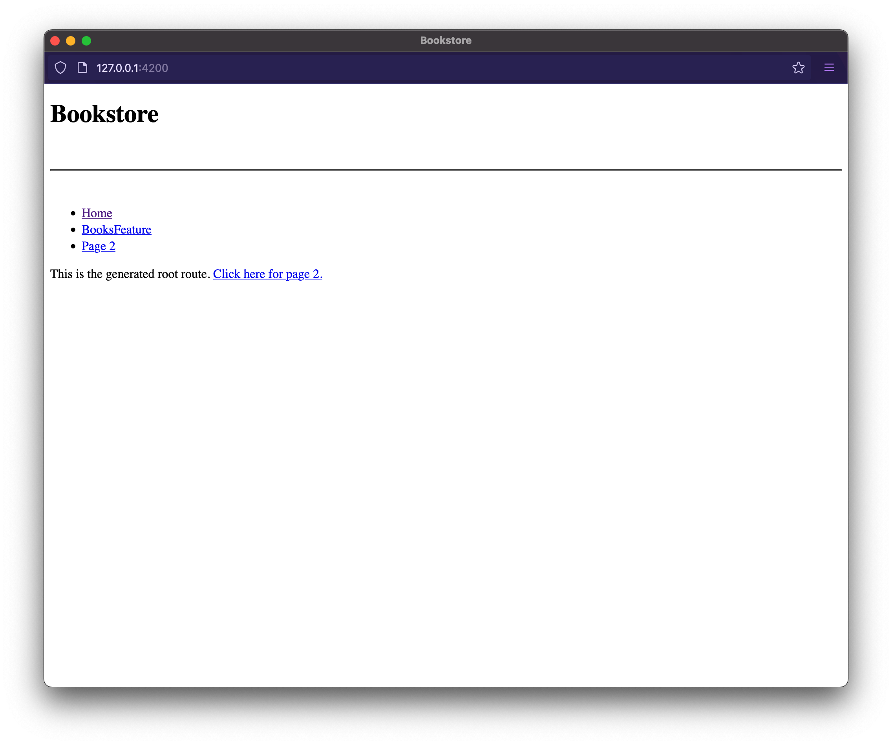

{#chapter-2}
# Chapter 2: Libraries

We have the skeleton of our application from [Chapter 1](#chapter-1).

So now we can start adding to our application by creating and using libraries. Before we dive straight into creating libraries, though, let's first understand the concept of libraries in an Nx workspace.

## Apps and Libs

A typical Nx workspace is structured into "apps" and "libs". This separation helps facilitate more modular architectures by following a separation of concerns methodology, incentivising the organisation of your source code and logic into smaller, more focused and highly cohesive units.

Nx automatically creates TypeScript path mappings in the `tsconfig.base.json`, such that they can be easily consumed by other apps or libs. More on that later.

```typescript
// example of importing from another workspace library
import { Button } from '@acme/ui'
...
```

As a result, consuming libraries is very straightforward, and similar to what you might already be accustomed to in your current setup, where you structure code within folders of your React application project. Having a dedicated library project is a much stronger boundary compared to just separating code into folders, though. Each Nx library has a so-called "public API", represented by a `index.ts` barrel file. This forces developers into an "API thinking" of what should be exposed and thus be made available for others to consume, and what on the others side should remain private within the library itself.

I> 80% of the logic should reside in libraries, 20% in apps.

A common mental model is to see the application as "containers" that link, bundle and compile functionality implemented in libraries for being deployed. As such, if we follow a 80/20 approach: place 80% of your logic into the `libs/` folder, and 20% into `apps/`.

Note, these libraries don't necessarily need to be built separately, but are rather consumed and built by the application itself directly. Hence, nothing changes from a pure deployment point of view. That said, it is totally possible to create so-called "buildable libraries" for enabling incremental builds[^incrementalbuilds] as well as "publishable libraries" for those scenarios where not only you want to use a specific library within the current Nx workspace, but also to publish it to some package repository (e.g NPM). You can read more about buildable and publishable libraries on the official Nx docs[^buildablelibs].

[^buildablelibs]: <https://nx.dev/structure/buildable-and-publishable-libraries>
[^incrementalbuilds]: <https://nx.dev/ci/incremental-builds>

### Organizing Libraries

Developers new to Nx are initially often hesitant to move their logic into libraries, because they assume it implies that those libraries need to be general purpose and shareable across applications. This is a common misconception. Moving code into libraries can be done from a pure code organization perspective. 

I> Ease of re-use might emerge as a positive side-effect of refactoring code into libraries by applying an "API thinking" approach. It is not the main driver though.

In fact when organizing libraries you should think about your business domains. Most often teams are aligned with those domains and thus a similar organization of the libraries in the `libs` folder might be most appropriate. Nx allows to nest libraries into sub-folders which makes it easy to reflect such structuring.

```
.
├── (...)
├── libs
│   └── books
│   │   └── feature
│   │   │  ├── src
│   │   │  ├── ...
│   │   │  └── ...
│   │   └── ui
│   │       ├── src
│   │       ├── ...
│   │       └── ...
│   └── ui
│       ├── src
│       ├── ...
│       └── ...
└── (...)
```

Note how we might have a `libs/books/feature` and `libs/books/ui` library, both of which are specific libraries for the `books` domain, while `libs/ui` represents a more general purpose library of UI elements such as a common UI design system that can be used across all of the other domains. Applying such a nested structure can be powerful to organize your workspace as well as for applying code ownership rules as we'll see later.

{#lib-categories}
### Categories of libraries

In a workspace, libraries are typically divided into four different types:

**Feature**
: Libraries that implement "smart" UI (e.g. is effectful, is connected to data sources, handles routing, etc.) for specific **business use cases**.
  
**UI**
: Libraries that contain only **presentational** components. That is, components that render purely from their props, and calls function handlers when interaction occurs.
  
**Data-access**
: Libraries that contain the means for interacting with external data services; external services are typically backend services.
  
**Utility**
: Libraries that contain common utilities that are shared by many projects.

Why do we make these distinctions between libraries? Good question! It is good to set boundaries for what a library should and should not do. This demarcation makes it easier to understand the capabilities of each library, and how they interact with each other.

More concretely, we can form rules about what each types of libraries can depend on. For example, UI libraries cannot use feature or data-access libraries, because doing so will mean that they are effectful.

We'll see in later in this chapter how we can use Nx to strictly enforce these boundaries.

## The `generate` command

The `nx generate` or the `nx g` command, as it is aliased, allows us to use Nx generator to create new applications, components, libraries, and more, to our workspace.

## Feature libraries

Let's create our first feature library: `books`.

```bash
nx g lib feature \
--directory books \
--appProject bookstore \
--tags  type:feature,scope:books
```

The `--directory` option allows us to group our libraries by nesting them under their parent directory. In this case the library is created in the `libs/books/feature` folder. It is aliased to `-d`.

The `--appProject` option lets Nx know that we want to make our feature library to be routable inside the specified application. This option is useful because Nx will do three things for us.

The `--tags` option lets us annotate our applications and libraries to express constraints within the workspace. The tags are added to `project.json`, and we'll see at the end of this chapter how they can be used to enforce different constraints.

1. Update `apps/bookstore/src/app/app.tsx` with the new route.
2. Update `apps/bookstore/src/main.tsx` to add `BrowserRouter` if it does not exist yet.
3. Add [`react-router-dom`](https://reacttraining.com/react-router/web/guides/quick-start) and related dependencies to the workspace, if necessary.

I> **Pro-tip:** You can pass the `--dryRun` option to `generate` to see the effects of the command before committing to disk.

Once the command completes, you should see the new directory.

```
.
├── (...)
├── libs
│   └── books
│       └── feature
│           ├── src
│           │   ├── index.ts
│           │   └── lib
│           ├── jest.config.js
│           ├── project.json
│           ├── README.md
│           ├── tsconfig.json
│           ├── tsconfig.lib.json
│           └── tsconfig.spec.json
└── (...)
```

Nx generated our library with some default code as well as scaffolding for linting (ESLint) and testing (Jest). You can run them with:

```bash
nx lint books-feature
nx test books-feature
```

You'll also see that the `App` component for `bookstore` has been updated to include the new route.

```typescript
import styled from 'styled-components';
import { Routes, Route, Link } from 'react-router-dom';
import { BooksFeature } from '@acme/books/feature';

const StyledApp = styled.div``;

export function App() {
  return (
    <StyledApp>
        {/* snip */}
      <div role="navigation">
        <ul>
          <li><Link to="/">Home</Link></li>
          <li><Link to="/feature">BooksFeature</Link></li>
          <li><Link to="/page-2">Page 2</Link></li>
        </ul>
      </div> 
      <Routes>
        <Route path="/" element={...} />
        <Route
          path="/feature"
          element={<BooksFeature/>}
        />
        <Route path="/page-2" element={...} />
      </Routes>
      {/* END: routes */}
    </StyledApp>
  );
};
export default App;
```

Additionally, the `main.tsx` file for `bookstore` has also been updated to render `<BrowserRouter />`. This render is needed in order for `<Route />` components to work, and Nx will handle the file update for us if necessary.

```typescript
import { StrictMode } from 'react';
import * as ReactDOM from 'react-dom/client';

import App from './app/app';

import { BrowserRouter } from 'react-router-dom';

const root = ReactDOM.createRoot(
  document.getElementById('root')
);
root.render(
  <StrictMode>
    <BrowserRouter>
      <App />
    </BrowserRouter>
  </StrictMode>,
);
```

Restart the development server again (`nx serve bookstore`), and you should see the updated application.

I> Be aware when you add a new project to the workspace, you must restart your development server. This restart is necessary in order for the TypeScript compiler to pick up new library paths, such as `@acme/books/feature`.

By using a monorepo, we've *skipped* a few steps that are usually required when creating a new library.

- Setting up the repo
- Setting up the CI
- Setting up the publishing pipeline--such as artifactory

And now we have our library! Wasn't that easy? Something that may have taken minutes or hours--sometimes even days--now takes only takes a few seconds.

***

*But* to our despair, when we navigate to <http://localhost:4200> again, we see a poorly styled application.



Let's remedy this situation by adding a component library that will provide better styling.

## UI libraries

Let's create the UI library.

```bash
nx g lib ui \
--tags type:ui,scope:books \
--no-interactive
```

The `--no-interactive` tells Nx to not prompt us with options, but instead use the default values.

I> Please note that we will make heavy use of [`styled-components`](https://www.styled-components.com) in this component library. Don't fret if you're not familiar with `styled-components`. If you know CSS then you should not have a problem understanding this section. To learn more about `styled-components` you can check our their [documentation](https://www.styled-components.com/docs/basics).

You should have a new folder: `libs/ui`.

```
acme
├── (...)
├── libs
│   ├── (...)
│   ├── ui
│   │   ├── src
│   │   │   ├── lib
│   │   │   └── index.ts
│   │   ├── .eslintrc
│   │   ├── jest.config.js
│   │   ├── README.md
│   │   ├── tsconfig.app.json
│   │   ├── tsconfig.json
│   │   └── tsconfig.spec.json
└── (...)
```

This library isn't quite useful yet, so let's add in some components.

```bash
nx g component GlobalStyles --project ui\
 --export --tags type:ui,scope:books
 
nx g component Button --project ui \
--export --tags type:ui,scope:books

nx g component Header --project ui \
--export --tags type:ui,scope:books

nx g component Main --project ui \
--export --tags type:ui,scope:books

nx g component NavigationList --project ui \
--export --tags type:ui,scope:books

nx g component NavigationItem --project ui \
--export --tags type:ui,scope:books
```

The `--project` option specifies which project (as found in the `projects` section of `workspace.json`) to add the new component to. It is aliased to `-p`.

The `--export` option tells Nx to export the new component in the `index.ts` file of the project so that it can be imported elsewhere in the workspace. You may leave this option off if you are generating private/internal components. It is aliased to `-e`.

If you do forget the `--export` option you can always manually add the export barrel to `index.ts`.

I> **Pro-tip:** There are additional options and aliases available to the `nx g component` command. To see a list of options run `nx g component --help`. Also, check out `nx g lib --help` and `nx g app --help`!

Next, let's go over the implementation of each of the components and what their purposes are.

### `GlobalStyles`

This component injects a global stylesheet into our application when used. It is particularly useful for overriding global style rules such as `body { margin: 0 }`.

**libs/ui/src/lib/global-styles/global-styles.tsx**

```typescript
import { createGlobalStyle } from 'styled-components';

export const GlobalStyles = createGlobalStyle`
  body {
    margin: 0;
    font-size: 16px;
    font-family: sans-serif;
  }

  * {
    box-sizing: border-box;
  }
`;

export default GlobalStyles;
```

### `Button`

This component is pretty self-explanatory. It renders a styled button and passes through other props to the actual `<button>`.

**libs/ui/src/lib/button/button.tsx**

```typescript
import { ButtonHTMLAttributes } from 'react';
import styled from 'styled-components';

const StyledButton = styled.button`
  font-size: 0.8rem;
  padding: 0.5rem;
  border: 1px solid #ccc;
  background-color: #fafafa;
  border-radius: 4px;

  &:hover {
    background-color: #80a8e2;
    border-color: #0e2147;
  }
`;

export function Button({
  children,
  ...rest
}: ButtonHTMLAttributes<HTMLButtonElement>) => {
  return <StyledButton {...rest}>{children}</StyledButton>;
};

export default Button;
```

### `Header` and `Main`

These two components are used for layout. The header component forms the top header bar, while the main component takes up the rest of the page.

**libs/ui/src/lib/header/header.tsx**

```typescript
import { HTMLAttributes } from 'react';
import styled from 'styled-components';

const StyledHeader = styled.header`
  padding: 1rem;
  background-color: #2657ba;
  color: white;
  display: flex;
  align-items: center;

  a {
    color: white;
    text-decoration: none;

    &:hover {
      text-decoration: underline;
    }
  }
  
  > h1 {
    margin: 0 1rem 0 0;
    padding-right: 1rem;
    border-right: 1px solid white;
  }
`;

export function Header(props: HTMLAttributes<HTMLElement>) (
  <StyledHeader>{props.children}</StyledHeader>
);

export default Header;
```

**libs/ui/src/lib/main/main.tsx**

```typescript
import { HTMLAttributes } from 'react';
import styled from 'styled-components';

const StyledMain = styled.main`
  padding: 0 1rem;
  width: 100%;
  max-width: 960px;
`;

export function Main(props: HTMLAttributes<HTMLElement>) (
  <StyledMain>{props.children}</StyledMain>
);

export default Main;
```

### `NavigationList` and `NavigationItem`

And finally, the `NavigationList` and `NavigationItem` components will render the navigation bar inside our top `Header` component.

**libs/ui/src/lib/navigation-list/navigation-list.tsx**

```typescript
import { HTMLAttributes } from 'react';
import styled from 'styled-components';

const StyledNavigationList = styled.div`
  ul {
    display: flex;
    margin: 0;
    padding: 0;
    list-style: none;
  }
`;

export function NavigationList(
  props: HTMLAttributes<HTMLElement>
) {
  return (
    <StyledNavigationList role="navigation">
      <ul>{props.children}</ul>
    </StyledNavigationList>
  );
};

export default NavigationList;
```

**libs/ui/src/lib/navigation-item/navigation-item.tsx**

```typescript
import { LiHTMLAttributes } from 'react';
import styled from 'styled-components';

const StyledNavigationItem = styled.li`
  margin-right: 1rem;
`;

export function NavigationItem(
  props: LiHTMLAttributes<HTMLLIElement>
) {
  return (
    <StyledNavigationItem>
      {props.children}
    </StyledNavigationItem>
  ) ;
};

export default NavigationItem;
```

## Using the UI library

Now we can use the new library in our `bookstore`'s app component.

**apps/bookstore/src/app/app.tsx**

```typescript
import {
  Link, 
  Navigate, 
  Routes, 
  Route 
} from 'react-router-dom';

import { BooksFeature } from '@acme/books/feature';

// importing the UI library into our App
import {
  GlobalStyles,
  Header,
  Main,
  NavigationItem,
  NavigationList
} from '@acme/ui';

export function App() {
  return (
    <>
      <GlobalStyles />
      <Header>
        <h1>Bookstore</h1>
        <NavigationList>
          <NavigationItem>
            <Link to="/books">Books</Link>
          </NavigationItem>
        </NavigationList>
      </Header>
      <Main>
        <Routes>
          <Route 
            path="/books" 
            element={<BooksFeature/>}
          />
          <Route path="/" 
            element={<Navigate to="/books" />}
          >
          </Route>
        </Routes>
      </Main>
    </>
  );
};

export default App;
```

Finally, let's restart our server (`nx serve bookstore`) and we will see a much improved UI.


We'll save our progress with a new commit.

```bash
git add .
git commit -m 'add books feature and ui components'
```

That's great, but we are still not seeing any books, so let's do something about this.

## Data-access libraries

What we want to do is fetch data from *somewhere* and display that in our books feature. Since we will be calling a backend service we should create a new **data-access** library.

```bash
nx g @nrwl/web:lib data-access \
--directory books \
--tags type:data-access,scope:books
``` 

You may have noticed that we are using a prefix `@nrwl/web:lib` instead of just `lib` like in our previous examples. This `@nrwl/web:lib` syntax means that we want Nx to run the `lib` (or `library`) generator provided by the `@nrwl/web` collection.

We were able to go without this prefix previously because the `nx.json` configuration has set `@nrwl/react` as the default option.

```json
{
  // ...
  "cli": {
    "defaultCollection": "@nrwl/react"
  },
  // ...
}
```

In this case, the `@nrwl/web:lib` generator will create a library to be used in a web (i.e. browser) context without assuming the framework used. In contrast, when using `@nrwl/react:lib`, it assumes that you want to generate a default component as well as potentially setting up routes.

I> **Pro-tip:** A collection in Nx contains a set of *generators* and *executors*. Generators can be invoked using the `generate` command. Executors perform actions on your code, including build, lint, and test and are invoked by issuing commands to Nx--such as `nx lint` and `nx test`. Use `nx list [collection]` to list everything provided by the collection--e.g. `nx list @nrwl/react`.

Back to the example. Let's modify the library to export a `getBooks` function to load our list of books.

**libs/books/data-access/src/lib/books-data-access.ts**

```typescript
export async function getBooks() {
  // TODO: We'll wire this up to an actual API later.
  // For now we are just returning some fixtures.
  return [
    {
      id: 1,
      title: 'The Picture of Dorian Gray',
      author: 'Oscar Wilde',
      rating: 3,
      price: 9.99
    },
    {
      id: 2,
      title: 'Frankenstein',
      author: 'Mary Wollstonecraft Shelley',
      rating: 5,
      price: 7.95
    },
    {
      id: 3,
      title: 'Jane Eyre',
      author: 'Charlotte Brontë',
      rating: 4,
      price: 10.95
    },
    {
      id: 4,
      title: 'Dracula',
      author: 'Bram Stoker',
      rating: 5,
      price: 14.99
    },
    {
      id: 5,
      title: 'Pride and Prejudice',
      rating: 4,
      author: 'Jane Austen',
      price: 12.85
    }
  ];
}
```

### Using the data-access library

The next step is to use the `getBooks` function within our `books` feature. We can do this with React's `useEffect` and `useState` hooks.

**libs/books/feature/src/lib/books-feature.tsx**

```typescript
import { useEffect, useState } from 'react';
import styled from 'styled-components';
import { getBooks } from '@acme/books/data-access';
import { Books } from '@acme/books/ui';

export function BooksFeature() {
  const [books, setBooks] = useState<any[]>([]);

  useEffect(() => {
    getBooks().then(setBooks);
  }, [
    // This effect runs only once on first component render
    // so we declare it as having no dependent state.
  ]);

  return (
    <>
      <h2>Books</h2>
      <Books books={books} />
    </>
  );
};

export default BooksFeature;
```

You'll notice that we're using two new components: `Books` and `Book`. They can be created as follows.

```bash
nx g lib ui --directory books
nx g component Books --project books-ui --export
nx g component Book --project books-ui --export
```

We generally want to put *presentational* components into their own UI library. This will prevent side-effects from bleeding into them, thus making them easier to understand and test.

I> Note how we generate a new `books-ui` library under `libs/books/ui` rather than using the already existing `ui` library under `libs/ui`. The reason is that the former contains specific presentational components for the books feature of our workspace, while the latter contains the general purpose UI components that form our corporate design system components.

Again, we will see later in this chapter how Nx enforces module boundaries.
 
**libs/books/ui/src/lib/books/books.tsx**

```typescript
import styled from 'styled-components';
import { Book } from '../book/book';

export interface BooksProps {
  books: any[];
}

const StyledBooks = styled.div`
  border: 1px solid #ccc;
  border-radius: 4px;
`;

export function Books({ books }: BooksProps) {
  return (
    <StyledBooks>
      {books.map(book => (
        <Book key={book.id} book={book} />
      ))}
    </StyledBooks>
  );
};

export default Books;
```

**libs/books/ui/src/lib/book/book.tsx**

```typescript
import styled from 'styled-components';
import { Button } from '@acme/ui';

export interface BookProps {
  book: any;
}

const StyledBook = styled.div`
  display: flex;
  align-items: center;
  border-bottom: 1px solid #ccc;
  &:last-child {
    border-bottom: none;
  }
  > span {
    padding: 1rem 0.5rem;
    margin-right: 0.5rem;
  }
  .title {
    flex: 1;
  }
  .price {
    color: #478d3c;
  }
`;

export function Book({ book }: BookProps) {
  return (
    <StyledBook>
      <span className="title">
        {book.title} by <em>{book.author}</em>
      </span>
      <span className="price">${book.price}</span>
    </StyledBook>
  );
};

export default Book;
```

Restart the server to check out our feature in action.


That's great and all, but you may have observed a couple of problems.

1. The `getBooks` data-access function is a stub and doesn't actually call out to a backend service.
   
2. We've been using `any` types when dealing with books data. For example, the return type of `getBooks` is `any[]` and our `BookProp` takes specifies `{ book: any }`. This makes our code unsafe and can lead to production bugs.

We'll address both problems in the [next chapter](#chapter-3). For now, let's wrap up by examining how Nx can enforce module boundaries between different types of libraries that we've created in this chapter.

## Enforcing module boundaries

Recall that earlier, when we generated our libraries we passed the `--tags` option to define a _type_ and _scope_ for each of them. Let's examine how we can use these tags to define and enforce clean separation of concerns within the workspace.

Open up the `.eslintrc.json` file at the root of your workspace. It will contain an entry for `@nrwl/nx/enforce-module-boundaries` as follows.

```json
"@nrwl/nx/enforce-module-boundaries": [
  "error",
  {
    "depConstraints": [
      {
        "sourceTag": "*",
        "onlyDependOnLibsWithTags": ["*"]
      }
    ],
    "allow": [],
    "enforceBuildableLibDependency": true
  }
]
```

The `depConstraints` section is the one you will be spending most time fine-tuning. It is an array of constraints, each consisting of `sourceTag` and `onlyDependOnLibsWithTags` properties. The default configuration has a wildcard `*` set as a value for both of them, meaning that any project can import (depend on) any other project.

The circular dependency chains such as `lib A -> lib B -> lib C -> lib A` are also not allowed. The self circular dependency (when lib imports from a named alias of itself), while not recommended, can be overridden by setting the flag `allowCircularSelfDependency` to true.

```json
"@nrwl/nx/enforce-module-boundaries": [
  "error",
  {
   "allowCircularSelfDependency": true,
    ...
  }
]
```

The `allow` array is a whitelist listing the import definitions that should be omitted from further checks. We will see how overrides work after we define the  
`depConstraints` section.

Finally, the flag `enforceBuildableLibDependency` prevents us from importing a non-buildable library into a buildable one.

### Using tags to enforce boundaries

Earlier in this chapter we presented [four categories of libraries](#lib-categories) we typically find in a Nx workspace.

1. Feature
2. UI
3. Data-access
4. Utility

We've already added these types as tags to our libraries when we ran the generate command (e.g. `--tags type:ui`). We also want to consider a fifth type of project in the workspace: `type:app` that we can tag all of our applications with.

Now, let's define some constraints for what each types of projects can depend on.

* Applications can  depend on any types of libraries, but not other applications.
* Feature libraries can depend on any other library.
* UI libraries can only depend on other UI or utility libraries.
* Utility libraries can only depend on other utility libraries.

Let's see how we can configure the ESLint rule to enforce the above constraints.

```json
"@nrwl/nx/enforce-module-boundaries": [
  "error",
  {
    ...
    "depConstraints": [
      {
        "sourceTag": "type:app",
        "onlyDependOnLibsWithTags": [
          "type:feature", "type:ui", "type:util"
        ]
      },
      {
        "sourceTag": "type:feature",
        "onlyDependOnLibsWithTags": [
          "type:feature", "type:ui", "type:util"
        ]
      },
      {
        "sourceTag": "type:ui",
        "onlyDependOnLibsWithTags": [
          "type:ui", "type:util"
        ]
      },
      {
        "sourceTag": "type:util",
        "onlyDependOnLibsWithTags": [
          "type:util"
        ]
      }
    ]
  }
]
```

Further, recall that we also have a second dimension to the tags of our libraries (e.g. `--tag scope:books`). The `scope` tag allows us to separate our applications and libraries into logical domains.

Imagine that we want to add an **admin** application to our workspace in order to manage our books. We can create such application with  
`nx g app admin --tags type:app,scope:admin`. It is likely that there will be some shared libraries required by both **admin** and **books** applications.

For example, if we have common components--such as buttons, modals, etc.-- then we can generate a shared library as follows.

```bash
nx g lib ui --directory shared --tags type:ui,scope:shared
```

And we want to enforce the following rules for scopes.

* Book application and libraries can only depend on `scope:books` libraries.
* Admin application and libraries can only depend on `scope:admin` libraries.
* _Any_ applications and libraries can depend on `scope:shared` libraries.
 
This is how we would define the constraints.

```json
"@nrwl/nx/enforce-module-boundaries": [
  "error",
  {
    ...
    "depConstraints": [
      {
        "sourceTag": "type:app",
        "onlyDependOnLibsWithTags": [
          "type:feature", "type:ui", "type:util"
        ]
      },
      ...
      {
        "sourceTag": "scope:books",
        "onlyDependOnLibsWithTags": [
          "scope:shared", "scope:books"
        ]
      },
      {
        "sourceTag": "scope:admin",
        "onlyDependOnLibsWithTags": [
          "scope:shared", "scope:admin"
        ]
      },
      {
        "sourceTag": "scope:shared",
        "onlyDependOnLibsWithTags": ["scope:shared"]
      }
    ]
  }
]
```

By forbidding cross-scope dependencies we can prevent a feature from `admin` being used in the `books` application. Also, domain-specific logic can be safely guarded against being used in the wrong domains.

These module boundaries are needed as the workspace grows, otherwise projects will become unmanageable, and changes will be hard to reason about. You can customize the tags however you want. If you have a multi-platform monorepo, you might add `platform:web`,  
`platform:node`,  `platform:native`, and `platform:all` tags.

Learn more about configuring boundaries with the Taming Code Organization with Module Boundaries in Nx article[^masteringboundaries].

[^masteringboundaries]: https://blog.nrwl.io/mastering-the-project-boundaries-in-nx-f095852f5bf4

Finally, let's commit our changes up to this point before moving on to the next chapter.

```bash
git add .
git commit -m 'implement books feature and link to application'
```

***

T> **Key points**
T>
T> There are four type of libraries: *feature*, *UI*, *data-access*, and *util*.
T> 
T> Nx provides us with the `nx generate` or `nx g` command to *quickly* create new libraries from scratch.
T>
T> When running `nx g` we can optionally provide a collection such as `@nrwl/web:lib` as opposed to `lib`. This will tell Nx to use the generator from that specific collection rather than the default as set in `nx.json`. 
T>
T> Nx enforces module boundaries through tags and `@nrwl/nx/enforce-module-boundaries` ESLint rule. The boundaries allow us to better organize and manage our workspace.
