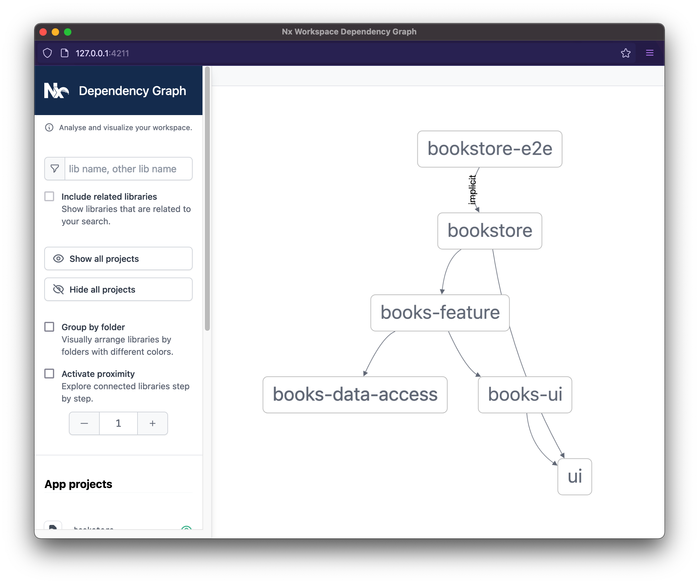

{#chapter-3}
# Chapter 3: Working effectively in a monorepo

In the previous two chapters we set up a `bookstore` application that renders a list of books for users to purchase.

In this chapter we explore how Nx enables us to work more effectively.

## The dependency graph

As we've seen in [Chapter 1](#chapter-1), Nx automatically generates the dependency graph for us. So why don't we see how it looks now?

```bash
nx dep-graph
```



Nx knows the dependency graph of the workspace without us having to configure anything. Because of this ability, Nx also understands which projects within the workspace are affected by any given changeset. Moreover, it can help us verify the correctness of the  affected projects.

I> Note that you can also manually add so-called "implicit dependencies" for those rare cases where there needs to be a dependency which however can not be computed from source code. Read more about that here: https://nx.dev/configuration/projectjson#implicitdependencies

## Understanding and verifying changes

Let's say we want to add a **checkout** button to each of the books in the list.

We can update our `Book`, `Books`, and `BooksFeature` components to pass along a new `onAdd` callback prop.

**libs/books/ui/src/lib/book/book.tsx**

```
import styled from 'styled-components';
import { Button } from '@acme/ui';

export interface BookProps {
  book: any;
  // New prop
  onAdd: (book: any) => void;
}

const StyledBook = styled.div`
  display: flex;
  align-items: center;
  border-bottom: 1px solid #ccc;
  &:last-child {
    border-bottom: none;
  }
  > span {
    padding: 1rem 0.5rem;
    margin-right: 0.5rem;
  }
  .title {
    flex: 1;
  }
  .rating {
    color: #999;
  }
  .price {
    color: #478d3c;
  }
`;

export const Book = ({ book, onAdd }: BookProps) => {
  const handleAdd = () => onAdd(book);
  return (
    <StyledBook>
      <span className="title">
        {book.title} by <em>{book.author}</em>
      </span>
      <span className="rating">{book.rating}</span>
      <span className="price">${book.price}</span>
      {/* Add button to UI */}
      <span>
        <Button onClick={handleAdd}>Add to Cart</Button>
      </span>
    </StyledBook>
  );
};

export default Book;
```

**libs/books/ui/src/lib/books/books.tsx**

```typescript
import styled from 'styled-components';
import { Book } from '../book/book';

export interface BooksProps {
  books: any[];
 // New prop
  onAdd: (book: any) => void;
}

const StyledBooks = styled.div`
  border: 1px solid #ccc;
  border-radius: 4px;
`;

export const Books = ({ books, onAdd }: BooksProps) => {
  return (
    <StyledBooks>
      {books.map(book => (
        // Pass down new callback prop
        <Book key={book.id} book={book} onAdd={onAdd} />
      ))}
    </StyledBooks>
  );
};

export default Books;
```

**libs/books/feature/src/lib/books-feature.tsx**

```typescript
import { useEffect, useState } from 'react';
import styled from 'styled-components';
import { getBooks } from '@acme/books/data-access';
import { Books, Book } from '@acme/books/ui';

export const BooksFeature = () => {
  const [books, setBooks] = useState<any[]>([]);

  useEffect(() => {
    getBooks().then(setBooks);
  }, [
    // This effect runs only once on first component render
    // so we declare it as having no dependent state.
  ]);

  return (
    <>
      <h2>Books</h2>
      {/* Pass a stub callback for now */}
      {/* We'll implement this properly in Chapter 4 */}
      <Books books={books} onAdd={book => alert(`Added ${book.title}`)} />
    </>
  );
};

export default BooksFeature;
```

We can ask Nx to show us how this change *affects* the projects within our workspace.

```bash
nx affected:dep-graph
```


As we can see, Nx knows that the `books-ui` library has changed from the main branch; it indicates the dependent projects affected by this change in *red*. Furthermore, Nx also allows us to re-test only the affected projects.

We can **lint** the projects affected by the changeset. 

```bash
nx affected:lint --parallel
```

Or run **unit tests** for the affected projects.

```bash
nx affected:test --parallel
```

Or even run **e2e tests** for the affected projects.

```bash
nx affected:e2e
```

Nx topologically sorts the projects such that they are run from bottom to top. That is, projects at the bottom of the dependency chain run first. We're also using the `--parallel` option to enable Nx to run our projects in parallel.

All of the `affected:*` commands use the Git history, comparing the current HEAD with a "base" to determine which Nx project(s) got changed. By default "base" refers to the `main` branch. You can customize that by either passing the `--base` flag to the command or by changing the `defaultBase` property in `nx.json`.

A> Note that in these projects, Nx is using [Jest](https://jestjs.io) and [Cypress](https://www.cypress.io/) to run unit and e2e tests respectively. They make writing and running tests are fast and simple as possible. If you're not familiar with them, please read their documentation to learn more.
A>
A> It is possible to use different executors by specifying them in the project's `project.json` configuration file.

So far we haven't been diligent about verifying that our changes are okay, so unsurprisingly our tests are failing.

I'll leave it to you as an exercise to fix the broken unit and e2e tests. A hint for the `App` component test, you should look into the `MemoryRouter` from React Router.

I> **Pro-Tip:** You can run a target for an individual project by issuing `nx [target] [project]` such as `nx test books-ui`, `nx test bookstore`, or `nx e2e bookstore-e2e`. You may also pass the `--watch` flag to re-run tests as soon there is a code change.

For the full solution please see the bookstore example repository: https://github.com/jaysoo/nx-react-book-example.

There are three additional affected commands in Nx.

1. `nx affected:build` - Builds only the affected applications and libraries.
2. `nx affected:apps` - Lists out all applications affected by the changeset.  
3. `nx affected:libs` - Lists out all libraries affected by the changeset.

The listing of affected applications and libraries can be useful in CI to trigger downstream jobs based on the output.

## Adding the API application

By the way, now is a good time to commit your changes if you haven't done so already: `git add . ; git commit -m 'added checkout button'`.

So far our `bookstore` application does not communicate with a real backend service. Let's create one using the [Express](https://expressjs.com) framework.

We'll need to install the `@nrwl/express` collection first.

```bash
npm install --save-dev @nrwl/express
```

Then we can do a dry run of the express app generator.

```bash
nx g @nrwl/express:app api \
--no-interactive \
--frontend-project=bookstore \
--dryRun
```


Everything looks good so let's run it for real.

```bash
nx g @nrwl/express:app api \
--no-interactive \
--frontend-project=bookstore
```

The `--frontend-project` option will add a proxy configuration to the `bookstore` application such that requests going to `/api/*` will be forwarded to the API

Just like our frontend application, we can use Nx to serve the API.

```bash
nx serve api
```

When we open up `http://localhost:3333/api` we'll be greeted by a friendly message.

```json

{ "message": "Welcome to api!" }
```

Next, let's implement the `/api/books` endpoint so that we can use it in our `books-data-access` library.

**apps/api/src/main.ts**

```typescript
import * as express from 'express';

const app = express();

app.get('/api', (req, res) => {
  res.send({ message: 'Welcome to api!' });
});

app.get('/api/books', (req, res) => {
  const books: any[] = [
    {
      id: 1,
      title: 'The Picture of Dorian Gray ',
      author: 'Oscar Wilde',
      rating: 5,
      price: 9.99
    },
    {
      id: 2,
      title: 'Frankenstein',
      author: 'Mary Wollstonecraft Shelley',
      rating: 4,
      price: 7.95
    },
    {
      id: 3,
      title: 'Jane Eyre',
      author: 'Charlotte Brontë',
      rating: 4.5,
      price: 10.95
    },
    {
      id: 4,
      title: 'Dracula',
      author: 'Bram Stoker',
      rating: 4,
      price: 14.99
    },
    {
      id: 5,
      title: 'Pride and Prejudice',
      author: 'Jane Austen',
      rating: 4.5,
      price: 12.85
    }
  ];
  res.send(books);
});

const port = process.env.port || 3333;
const server = app.listen(port, () => {
  console.log(`Listening at http://localhost:${port}/api`);
});
server.on('error', console.error);
```

Let's update our data-access library to call the proxy endpoint.

**libs/books/data-access/src/lib/books-data-access.ts**

```typescript
export async function getBooks() {
  const data = await fetch('/api/books', {
    headers: {
      'Content-Type': 'application/json'
    }
  });
  return data.json();
}
```

If we restart both applications (`nx serve api` and `nx serve bookstore`; or in a single command `nx run-many --target=serve --projects=api,bookstore`) we'll see that our [bookstore](http://localhost:4200) is still working in the browser. Moreover, we can verify that our `/api/books` endpoint is indeed
being called.


Let's commit our changes: `git add . ; git commit -am 'added api app'`.

### Sharing models between frontend and backend

Recall that we previously used the `any` type when working with books data. This is bad practice as it may lead to uncaught type errors in production.

A better idea would be to create a utility library containing some shared models to be used by both the frontend and backend.

```bash
nx g @nrwl/node:lib shared-models --no-interactive
```

**libs/shared-models/src/lib/shared-models.ts**

```typescript
export interface IBook {
  id: number;
  title: string;
  author: string;
  rating: number;
  price: number;
}
```

And now we can update the following five files to use the new model:

**apps/api/src/main.ts**

```typescript
import { IBook } from '@acme/shared-models';
// ...

app.get('/api/books', (req, res) => {
  const books: IBook[] = [
    // ...
  ];
  res.send(books);
});

// ...
```

**libs/books/data-access/src/lib/books-data-access.ts**

```typescript
import { IBook } from '@acme/shared-models';

// Add correct type for the return value
export async function getBooks(): Promise<IBook[]> {
  const data = await fetch('http://localhost:3333/api/books');
  return data.json();
}

```

**libs/books/feature/src/lib/books-feature.tsx**

```typescript
...
import { IBook } from '@acme/shared-models';

export const BooksFeature = () => {
  // Properly type the array
  const [books, setBooks] = useState<IBook[]>([]);

  // ...

  return (
    <>
      <h2>Books</h2>
      <Books books={books} onAdd={book => alert(`Added ${book.title}`)} />
    </>
  );
};

export default BooksFeature;
```

**libs/books/ui/src/lib/books/books.tsx**

```typescript
// ...
import { IBook } from '@acme/shared-models';

// Replace any with IBook
export interface BooksProps {
  books: IBook[];
  onAdd: (book: IBook) => void;
}

// ...

export default Books;
```

**libs/books/ui/src/lib/book/book.tsx**

```typescript
// ...
import { IBook } from '@acme/shared-models';

// Replace any with IBook
export interface BookProps {
  book: IBook;
  onAdd: (book: IBook) => void;
}

// ...

export default Book;
```


By using Nx, we have created a shared model library and refactored both frontend and backend code in about a minute.

Another major benefit of working within a monorepo is that we can check in these changes as a *single commit*: `git add . ; git commit -m 'add shared models'`. The corresponding pull-request with the commit will have the full story, rather than being fragmented amongst multiple pull-requests and repositories.

## Automatic code formatting

One of the easiest ways to waste time as a developer is on code style. We can spend *hours* debating with one another on whether we should use semicolons or not (you should); or whether we should use a comma-first style or not (you should not).

[Prettier](https://prettier.io) was created to stop these endless debates over code style. It is highly opinionated and provides minimal configuration options. Best of all, it can format our code *automatically*. This means that we no longer need to manually fix code to conform to the code style.

Nx workspaces come with Prettier installed from the get-go. With it, we can check the formatting of the workspace, and format workspace code automatically.

```bash
# Checks for format conformance with Prettier.
# Exits with error code when the check fails.
nx format:check

# Formats files with Prettier.
nx format:write
```

***

T> **Key points**
T>
T> Nx understands the dependency graph of projects within our workspace.
T> 
T> We can ask Nx to generate the dependency graph automatically, as well as highlight the parts of the graph that are affected by a given changeset.
T>
T> Nx can retest and rebuild only the affected projects within our workspace.
T>
T> By using a monorepo, related changes in different projects can be in the same changeset (i.e. pull-request), which gives us the full picture of the changes.
T>
T> Nx automatically formats our code for us in an opinionated way using Prettier.

