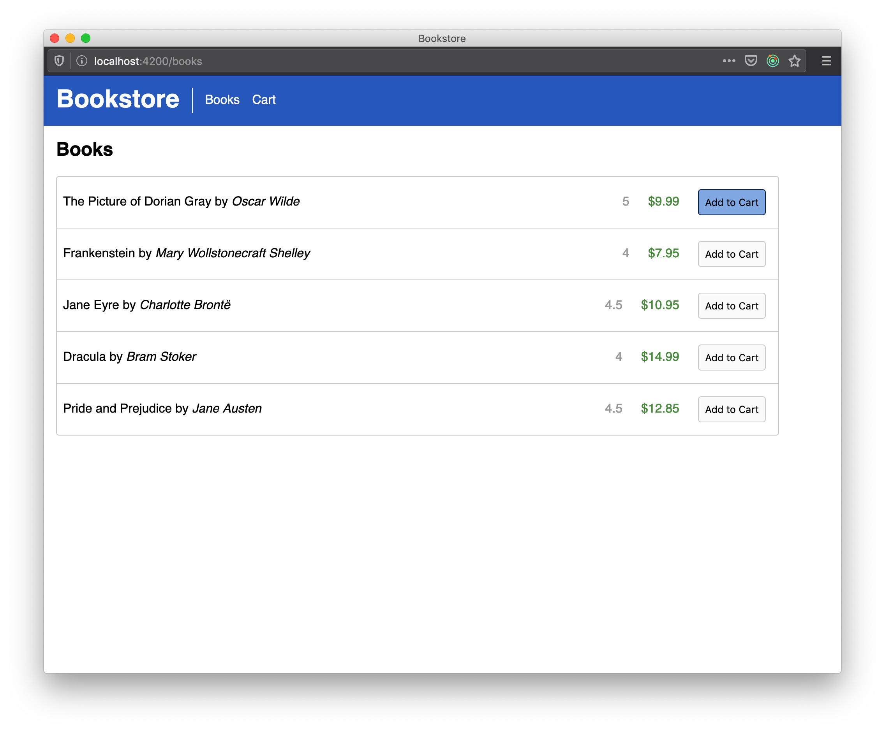
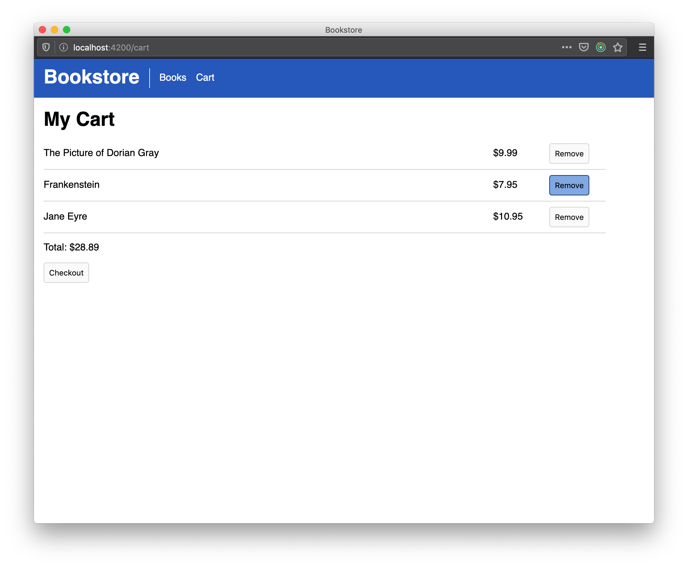
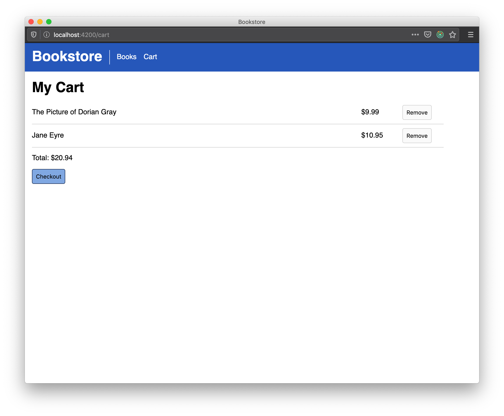
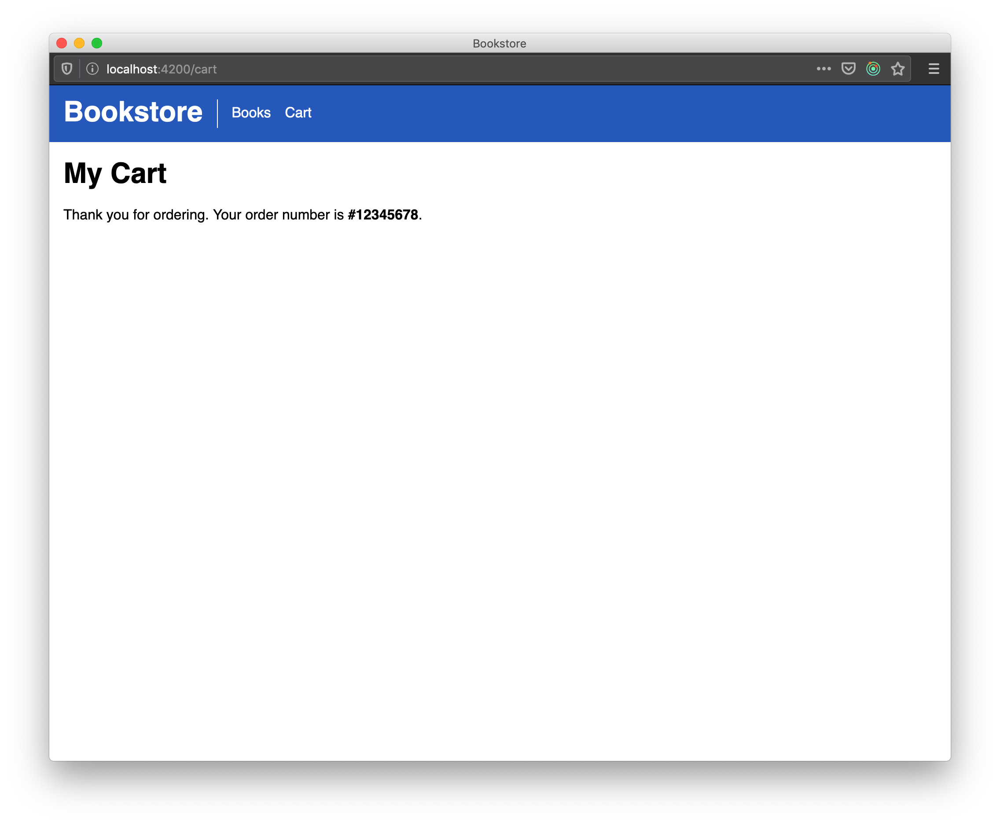

{#chapter-4}
# Chapter 4: Bringing it all together

Thus far in this book we've seen how to generate and organize our React application, libraries, and an Express application. In this chapter we will apply what we've learned so far to implement the checkout feature. We will also discuss how we can provide interaction between features through the use of React context and reducer.

## Checkout API and shared models

Let's add the new shared models for our shopping cart.

**libs/shared-models/src/lib/shared-models.ts**

```typescript
// ...

export interface ICartItem {
  id: number;
  description: string;
  cost: number;
}

export interface ICart {
  items: ICartItem[];
}
```

Next, we can add a checkout endpoint to the API application.

**apps/api/src/main.ts**

```typescript
import { IBook, ICart } from '@acme/shared-models';
// ...

app.post('/api/checkout', (req, res) => {
  const cart: ICart = req.body;
  console.log('Checking out...', JSON.stringify(cart, null, 2));
  res.send({ order: '12345678' });
});

// ...
```

This endpoint doesn't do anything except log and return a fake order number. In a real world application you would interact with a database or perhaps a microservice. Since this book is about React development, we will gloss over the implementation details of this endpoint.

## Cart data-access library

Now we can add our shopping cart data-access library to the frontend application.

```bash
# Remember that we want a generic web library for data-access
nx g @nrwl/web:lib data-access --directory=cart
```

The cart data-access library should provide a `checkout` function we can use in our feature.

**libs/cart/data-access/src/lib/cart-data-access.ts**

```typescript
import { ICart } from '@acme/shared-models';

export async function checkout(cart: ICart): Promise<{ sucess: boolean }> {
  const data = await fetch('/api/checkout', {
    method: 'POST',
    headers: {
      'Content-Type': 'application/json',
    },
    body: JSON.stringify(cart),
  });
  return data.json();
}
```

### Managing cart state using Redux Toolkit

The cart state will contain multiple sub-values (cart items, status flag, etc.), and we'll also need to communicate with the API endpoint. To help use manage this complexity, we can take advantage of [Redux Toolkit](https://redux-toolkit.js.org/). Luckily, Nx comes with a schematic to help set this up. 

```bash
nx g redux cart --project=cart-data-access --appProject=bookstore
```

Here, we are creating a new Redux slice `cart` in the `cart-data-access` library that we created previously. As well, the schematic will install the necessary npm packages for Redux Toolkit, add configure the store in `bookstore` app, and add the `cart` slice.

When the command completes, open up `apps/bookstore/src/main.tsx` and you'll see the following.

```typescript
// ...
import { configureStore, getDefaultMiddleware } from '@reduxjs/toolkit';
import { Provider } from 'react-redux';

import { CART_FEATURE_KEY, cartReducer } from '@acme/cart/data-access';

const store = configureStore({
  reducer: { [CART_FEATURE_KEY]: cartReducer },
  // Additional middleware can be passed to this array
  middleware: [...getDefaultMiddleware()],
  devTools: process.env.NODE_ENV !== 'production',
  // Optional Redux store enhancers
  enhancers: [],
});

ReactDOM.render(
  <Provider store={store}>
    <React.StrictMode>
      <BrowserRouter>
        <App />
      </BrowserRouter>
    </React.StrictMode>
  </Provider>,
  document.getElementById('root')
);
```

Awesome, we didn't have to anything to set up Redux in our application!

Next, let's take a look at the slice itself.

**libs/cart/data-access/src/lib/cart.slice.ts**

```typescript
import {
  createAsyncThunk,
  createEntityAdapter,
  createSelector,
  createSlice,
  EntityState,
  PayloadAction,
} from '@reduxjs/toolkit';

export const CART_FEATURE_KEY = 'cart';

/*
 * Update these interfaces according to your requirements.
 */
export interface CartEntity {
  id: number;
}

export interface CartState extends EntityState<CartEntity> {
  loadingStatus: 'not loaded' | 'loading' | 'loaded' | 'error';
  error: string;
}

export const cartAdapter = createEntityAdapter<CartEntity>();

/**
 * Export an effect using createAsyncThunk from
 * the Redux Toolkit: https://redux-toolkit.js.org/api/createAsyncThunk
 *
 * e.g.
 * \```
 * import React, { useEffect } from 'react';
 * import { useDispatch } from 'react-redux';
 *
 * // ...
 *
 * const dispatch = useDispatch();
 * useEffect(() => {
 *   dispatch(fetchCart())
 * }, [dispatch]);
 * \```
 */
export const fetchCart = createAsyncThunk(
  'cart/fetchStatus',
  async (_, thunkAPI) => {
    /**
     * Replace this with your custom fetch call.
     * For example, `return myApi.getCarts()`;
     * Right now we just return an empty array.
     */
    return Promise.resolve([]);
  }
);

export const initialCartState: CartState = cartAdapter.getInitialState({
  loadingStatus: 'not loaded',
  error: null,
});

export const cartSlice = createSlice({
  name: CART_FEATURE_KEY,
  initialState: initialCartState,
  reducers: {
    add: cartAdapter.addOne,
    remove: cartAdapter.removeOne,
    // ...
  },
  extraReducers: (builder) => {
    builder
      .addCase(fetchCart.pending, (state: CartState) => {
        state.loadingStatus = 'loading';
      })
      .addCase(
        fetchCart.fulfilled,
        (state: CartState, action: PayloadAction<CartEntity[]>) => {
          cartAdapter.setAll(state, action.payload);
          state.loadingStatus = 'loaded';
        }
      )
      .addCase(fetchCart.rejected, (state: CartState, action) => {
        state.loadingStatus = 'error';
        state.error = action.error.message;
      });
  },
});

/*
 * Export reducer for store configuration.
 */
export const cartReducer = cartSlice.reducer;

/*
 * Export action creators to be dispatched. For use with the `useDispatch` hook.
 *
 * e.g.
 * \```
 * import React, { useEffect } from 'react';
 * import { useDispatch } from 'react-redux';
 *
 * // ...
 *
 * const dispatch = useDispatch();
 * useEffect(() => {
 *   dispatch(cartActions.add({ id: 1 }))
 * }, [dispatch]);
 * \```
 *
 * See: https://react-redux.js.org/next/api/hooks#usedispatch
 */
export const cartActions = cartSlice.actions;

/*
 * Export selectors to query state. For use with the `useSelector` hook.
 *
 * e.g.
 * \```
 * import { useSelector } from 'react-redux';
 *
 * // ...
 *
 * const entities = useSelector(selectAllCart);
 * \```
 *
 * See: https://react-redux.js.org/next/api/hooks#useselector
 */
const { selectAll, selectEntities } = cartAdapter.getSelectors();

export const getCartState = (rootState: unknown): CartState =>
  rootState[CART_FEATURE_KEY];

export const selectAllCart = createSelector(getCartState, selectAll);

export const selectCartEntities = createSelector(getCartState, selectEntities);
```

If you're not familiar with Redux Toolkit, you'll notice a few new utilities.

1. `createEntityAdapter` function returns a set of case reducers and selectors that makes working with normalized entities much simpler.
2. `createAsyncThunk` function returns a thunk that allows us to handle async dataflow.
3. `createSlice` function removes much of the boilerplate of Redux by allowing us to define the actions and case reducers together.
4. The case reducers--either the reducer methods, or `builder.addCase` in `extraReducers`--mutate the state rather than working with it immutably. Redux Toolkit affords the ability to perform mutatable operations because it wraps the reducer around [immer](https://github.com/immerjs/immer). 

The generated code is a great start for many use cases. We do need to make a few tweaks, as well as add additional selectors. So let's update the slice to the following:


**libs/cart/data-access/src/lib/cart.slice.ts**

```typescript
import {
  createAsyncThunk,
  createEntityAdapter,
  createSelector,
  createSlice,
  EntityState,
} from '@reduxjs/toolkit';
import { ICartItem } from '@acme/shared-models';
import { checkout } from './cart-data-access';

export const CART_FEATURE_KEY = 'cart';

export interface CartState extends EntityState<ICartItem> {
  cartStatus: 'ready' | 'pending' | 'ordered' | 'error';
  error: string;
  order?: string;
}

export const cartAdapter = createEntityAdapter<ICartItem>();

export const checkoutCart = createAsyncThunk<{ order: string }, ICartItem[]>(
  'cart/checkoutStatus',
  (items) => checkout({ items })
);

export const initialCartState: CartState = cartAdapter.getInitialState({
  cartStatus: 'ready',
  error: null,
});

export const cartSlice = createSlice({
  name: CART_FEATURE_KEY,
  initialState: initialCartState,
  reducers: {
    add: cartAdapter.addOne,
    remove: cartAdapter.removeOne,
  },
  extraReducers: (builder) => {
    builder
      .addCase(checkoutCart.pending, (state: CartState) => {
        state.cartStatus = 'pending';
      })
      .addCase(checkoutCart.fulfilled, (state: CartState, action) => {
        state.order = action.payload.order;
        state.cartStatus = 'ordered';
      })
      .addCase(checkoutCart.rejected, (state: CartState, action) => {
        state.cartStatus = 'error';
        state.error = action.error.message;
      });
  },
});

export const cartReducer = cartSlice.reducer;

export const cartActions = cartSlice.actions;

const { selectAll } = cartAdapter.getSelectors();

export const getCartState = (rootState: unknown): CartState =>
  rootState[CART_FEATURE_KEY];

export const selectCartItems = createSelector(getCartState, selectAll);

export const selecteCartStatus = createSelector(
  getCartState,
  (state) => state.cartStatus
);

export const selectOrderNumber = createSelector(
  getCartState,
  (state) => state.order
);

export const selectTotal = createSelector(selectCartItems, (items) =>
  items.reduce((total, item) => total + item.cost, 0)
);

```

## Cart feature library

Now that data-access has been sorted out, let's go ahead and add our shopping cart feature library.

```bash
nx g lib feature --directory=cart --appProject=bookstore
```

Recall that `--appProject` installs the new feature as a route to the bookstore application. Nx guesses what the route path should be based on your library name. Additionally, Nx will also guess where to add the new `<Link>` in your app component.

The guesses made by Nx may not be correct, so let's make sure we have the proper setup.

**apps/bookstore/src/app/app.tsx**

```typescript
// ...

export const App = () => {
  return (
    <>
      <GlobalStyles />
      <Header>
        <h1>Bookstore</h1>
        <NavigationList>
          <NavigationItem>
            <Link to="/books">Books</Link>
          </NavigationItem>
          <NavigationItem>
            <Link to="/cart">Cart</Link>
          </NavigationItem>
        </NavigationList>
      </Header>
      <Main>
        <Route path="/books" component={BooksFeature} />
        <Route path="/cart" component={CartFeature} />
        <Route exact path="/" render={() => <Redirect to="/books" />} />
      </Main>
    </>
  );
};

// ...
``` 

Next up, let's implement our `CartFeature` component. We'll keep the implementation simple by providing the following:

1. Display each added cart item.
2. Provide a button to remove an item.
3. Show the total cost of all items.
4. Provide a button to checkout (i.e. call the checkout API).
5. Display a success message when the API returns successfully.

Something like this should do.

**libs/cart/feature/src/lib/cart-feature.tsx**

```typescript
import React from 'react';
import styled from 'styled-components';
import { Button } from '@acme/ui';
import { useDispatch, useSelector } from 'react-redux';
import {
  cartActions,
  selectCartItems,
  selecteCartStatus,
  selectOrderNumber,
  selectTotal,
  checkoutCart,
} from '@acme/cart/data-access';

const StyledCartFeature = styled.div`
  .item {
    display: flex;
    align-items: center;
    padding-bottom: 9px;
    margin-bottom: 9px;
    border-bottom: 1px #ccc solid;
  }
  .description {
    flex: 1;
  }
  .cost {
    width: 10%;
  }
  .action {
    width: 10%;
  }
`;

export const CartFeature = () => {
  const dispatch = useDispatch();
  const cartItems = useSelector(selectCartItems);
  const status = useSelector(selecteCartStatus);
  const order = useSelector(selectOrderNumber);
  const total = useSelector(selectTotal);
  const cartIsEmpty = cartItems.length === 0;
  return (
    <StyledCartFeature>
      <h1>My Cart</h1>
      {order ? (
        <p>
          Thank you for ordering. Your order number is <strong>#{order}</strong>
          .
        </p>
      ) : (
        <>
          {cartIsEmpty ? <p>Your cart is empty</p> : null}
          <div>
            {cartItems.map((item) => (
              <div className="item" key={item.id}>
                <span className="description">{item.description}</span>
                <span className="cost">${item.cost.toFixed(2)}</span>
                <span className="action">
                  <Button onClick={() => dispatch(cartActions.remove(item.id))}>
                    Remove
                  </Button>
                </span>
              </div>
            ))}
          </div>
          <p>Total: ${total.toFixed(2)}</p>
          <Button
            disabled={cartIsEmpty || status !== 'ready'}
            onClick={() => dispatch(checkoutCart(cartItems))}
          >
            Checkout
          </Button>
        </>
      )}
    </StyledCartFeature>
  );
};

export default CartFeature;
```

Notice that we can dispatch the generated `cartActions` as well as the async thunk `checkoutCart` through the Redux store. This is because Redux Toolkit adds thunk support by default. The rest of the code is fairly standard Redux usage within a React component--select state via `useSelector` and dispatch actions using `useDispatch`.

Again, we are using `styled-components` to style the `CartFeature` component. You may choose to further extract smaller styled components out of the feature, rather than using `className` to target child elements.


## Wiring up add button in books feature

We had previously used `alert` when users clicked on the *Add* button in the books feature. Now that we have our cart feature ready, we can wire up this behavior properly.

Let's update the `BooksFeature` component as follows.

**libs/cart/feature/src/lib/books-feature.tsx**

```typescript
import React, { useEffect, useState } from 'react';
import styled from 'styled-components';
import { getBooks } from '@acme/books/data-access';
import { Books } from '@acme/books/ui';
import { IBook } from '@acme/shared-models';
import { useDispatch } from 'react-redux';
import { cartActions } from '@acme/cart/data-access';

export const BooksFeature = () => {
  const [books, setBooks] = useState<IBook[]>([]);
  const dispatch = useDispatch();

  useEffect(() => {
    getBooks().then(setBooks);
  }, []);

  return (
    <>
      <h2>Books</h2>
      <Books
        books={books}
        onAdd={(book) =>
          // Using add action from cart slice
          dispatch(
            cartActions.add({
              id: book.id,
              description: book.title,
              cost: book.price,
            })
          )
        }
      />
    </>
  );
};

export default BooksFeature;
```

Let's look at the final result by serving up our `bookstore` and `api` apps.

```bash
# Run these in different terminal windows
nx serve api
nx serve bookstore
``` 

Open up `http://localhost:4200` and you should be able go through the full workflow: Add books to cart, navigate to the Cart page, remove books from cart, and then check out.






Looking good! However, we're not quite yet finished. Don't forget about our tests!

```bash
nx affected:test
```

Tests are broken, so please fix them up. If you do get stuck though, you may refer to the solution repository: https://github.com/jaysoo/nx-react-book-example. 

You've made it this far! Now might be a good time to take a quick break. In the next chapter we will switch gears from feature development and look at how we can leverage Nx for CI and deployment.
